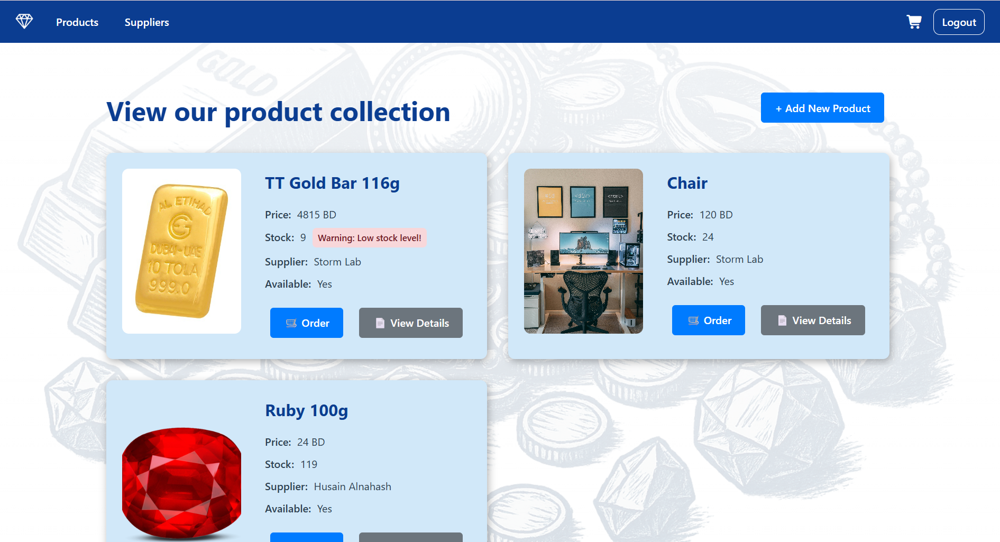

# Dar Altaweesh Inventory Management System

## 📜 Overview

A full-stack MVC application be created for Dar Altawawish to help the firm display the products, track their suppliers and orders.

## 🪧 Demonstration

## ⚙️ Features

- Product catalog with images
- Stock level tracking
- Order management
- Supplier information
- Low stock alerts

## ⚙️ Technologies

| Method           | Endpoint                   | 
|------------------|----------------------------|
| Server           | Node.js & Express.js       | 
| Database         | Mongo DB & Mongoose        | 
| Template         | JSX view engine, CSS       |
| Bcrypt           | Password hashing           | 
| Method-Override  | Mongo DB & Mongoose        | 
| Morgan           | Request logging            | 
| dotenv           | Environment configuration  |

## 🔌Models

#### Supplier

- logo: png, jpg, jpeg
- name: String
- phone: String
- email: String

#### Product

- img: png, jpg, jpeg
- name: String
- price: float
- stock: int
- supplier: String `(refers to supplier model)`

#### Order

- img: png, jpg, jpeg `(refers to product model)`
- product name: String `(refers to product model)`
- supplier name: String `(refers to supplier model)`
- status: String `(Option: "Pending", "Shipped", "Delivered", "Received".)`
- date: Date
- quantity: number
- total: number `(Auto-calculated: product.price * quantity)`

## 🗺️ Planning

### Routing table

#### 1. Authentication Endpoints:

| Method | Endpoint               | Description                              | Authentication Required |
|--------|------------------------|------------------------------------------|-------------------------|
| POST   | `/users/`              | Register a new user                      | No                      |
| POST   | `/users/login`         | User login, returns a token              | No                      |
| GET    | `/users/logout`        | Logout the user, invalidate the token    | Yes                     |

#### 2. Product Endpoints:

| Method | Endpoint               | Description                              | Authentication Required |
|--------|------------------------|------------------------------------------|-------------------------|
| GET    | `/products`            | List all products                        | Yes                     |
| POST   | `/products`            | Create a new product                     | Yes                     |
| GET    | `/products/:id`        | View details of a specific product       | Yes                     |
| PUT    | `/products/:id`        | Update an existing product               | Yes                     |
| DELETE | `/products/:id`        | Delete a specific product                | Yes                     |

#### 3. Order Endpoints:

| Method | Endpoint              | Description                               | Authentication Required |
|--------|-----------------------|-------------------------------------------|-------------------------|
| GET    | `/orders`             | List all orders                           | Yes                     |
| POST   | `/orders`             | Create a new order                        | Yes                     |
| GET    | `/orders/:id`         | View details of a specific order          | Yes                     |
| PUT    | `/orders/:id`         | Update the status of an order             | Yes                     |
| DELETE | `/orders/:id`         | Cancel a specific order                   | Yes                     |

#### 4. Supplier Endpoints:

| Method | Endpoint              | Description                               | Authentication Required |
|--------|-----------------------|-------------------------------------------|-------------------------|
| GET    | `/suppliers`          | List all suppliers                        | Yes                     |
| POST   | `/suppliers`          | Create a new supplier                     | Yes                     |
| GET    | `/suppliers/:id`      | View details of a specific supplier       | Yes                     |
| PUT    | `/suppliers/:id`      | Update an existing supplier               | Yes                     |
| DELETE | `/suppliers/:id`      | Delete a specific supplier                | Yes                     |

#### 5. Web Routes (For frontend, non-API):

| Method | Endpoint              | Description                               | Authentication Required |
|--------|-----------------------|-------------------------------------------|-------------------------|
| GET    | `/products`           | Display product listing page              | Yes                     |
| GET    | `/products/:id`       | Display a specific product page           | Yes                     |
| GET    | `/login`              | Display login page                        | No                      |
| GET    | `/users`              | Display registration page                 | No                      |
| GET    | `/orders`             | Display the user’s orders                 | Yes                     |
| GET    | `/orders/:id`         | Display details of a specific order       | Yes                     |
| GET    | `/suppliers`          | Display supplier listing                  | Yes                     |
| GET    | `/suppliers/:id`      | Display specific supplier details         | Yes                     |

#### 🔜 Future updates

- Add user roles (Manager, Employee, Admin, Customer).
- Expand the system to allow customers to order products from it.
- Add category filtering and search.
- Improve UI/UX styling.

#### ☑️ Trello Checklist

To find my detailed checklist that help me plan my daily progress in this project, click [here](https://trello.com/b/a2DOcAiJ/project-2-inventory-system-planner)
